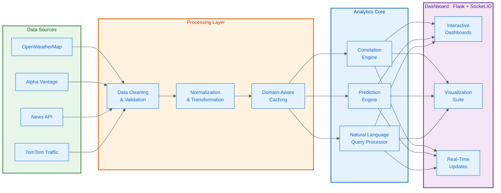
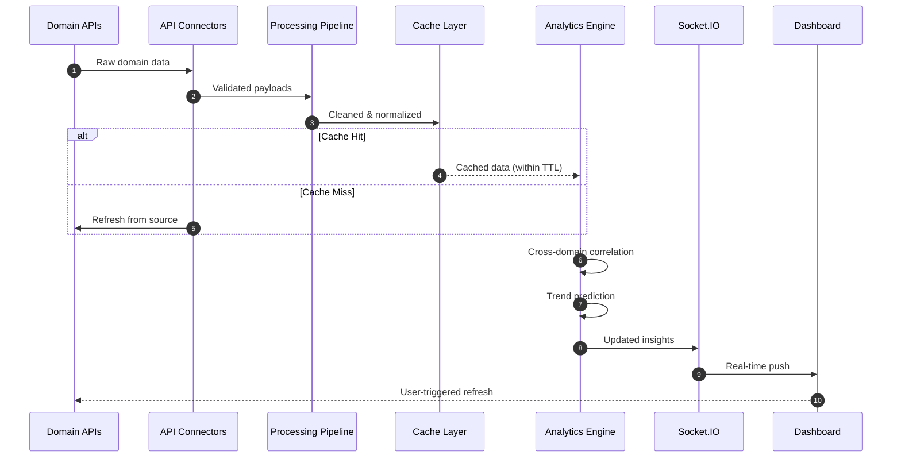

# Cross-Domain Predictive Analytics Dashboard

[](https://github.com/damsolanke/Cross_Domain_Predictive_Analytics_Dashboard/actions/workflows/ci.yml)

Real-time predictive analytics platform that correlates data across four public API domains — weather, economic indicators, news sentiment, and transportation — to surface cross-domain insights via an interactive Flask dashboard with WebSocket updates.

## Architecture



### Data Domains

| Domain | Source | Cache TTL | What it provides |
|--------|--------|-----------|------------------|
| **Weather** | OpenWeatherMap API | 30 min | Current conditions, 5-day forecasts, temperature trends |
| **Economic** | Alpha Vantage API | 60 min | Market indices, exchange rates, sector performance |
| **News/Social** | News API | 15 min | Trending topics, sentiment scores, keyword frequency |
| **Transportation** | TomTom Traffic API | 10 min | Traffic density, congestion indices, transit metrics |

### Data Flow



## Key Capabilities

| Capability | Implementation | Detail |
|-----------|---------------|--------|
| **Cross-domain correlation** | Pearson + rolling window | Identifies non-obvious relationships between weather, markets, traffic, and news |
| **Natural language queries** | Intent classification + entity extraction | Ask "How does temperature affect traffic congestion?" and get visual answers |
| **Real-time updates** | Flask-SocketIO with WebSocket fallback | Dashboard refreshes without page reload when new data arrives |
| **Predictive analytics** | scikit-learn time-series models | Forecasts future trends using cross-domain feature combinations |
| **Graceful degradation** | 3-tier fallback: API → cache → demo data | System stays operational even when all external APIs are down |
| **Use case templates** | 4 pre-built analytical environments | Supply chain, public health, urban infrastructure, financial strategy |

## Quick Start

```bash
git clone https://github.com/damsolanke/Cross_Domain_Predictive_Analytics_Dashboard.git
cd Cross_Domain_Predictive_Analytics_Dashboard
pip install -r requirements.txt
```

```bash
# Configure API keys (optional — runs with demo data without them)
cp .env.example .env
# Edit .env with your API keys

# Start the dashboard
python run.py
# → http://localhost:5000
```

The system works without API keys — it falls back to generated demo data with realistic domain patterns.

## Design Decisions

| Decision | Why | Tradeoff |
|----------|-----|----------|
| **Flask over FastAPI** | Jinja templates for server-rendered dashboards, mature SocketIO integration | No async by default; mitigated by eventlet/gevent |
| **Socket.IO for real-time** | Bidirectional communication, automatic reconnection, room-based broadcasts | Additional server process; simpler than polling |
| **Demo data fallback** | Portfolio reviewers can evaluate the full system without obtaining 4 API keys | Demo patterns are synthetic; real API keys unlock live data |
| **Domain-specific cache TTLs** | Weather changes faster than economic indicators — cache durations reflect real-world update frequencies | More complex invalidation logic |
| **In-memory storage** | No database setup required for reviewers; caching layer handles persistence | Data lost on restart; acceptable for analytics dashboard |
| **Multi-domain correlation engine** | Cross-domain insights are the differentiator — weather×traffic, sentiment×markets | Correlation ≠ causation; confidence scoring helps |

## Project Structure

```
├── app/                          # Main application package
│   ├── api/                      #   API routes + domain connectors
│   │   └── connectors/           #   weather, economic, social, transport
│   ├── data_processing/          #   cleaner, correlator, transformer, validator
│   ├── models/                   #   ML prediction models (weather, economic, transport)
│   ├── nlq/                      #   Natural language query processor + routes
│   ├── system_integration/       #   Pipeline orchestration, socket events, correlation engine
│   ├── visualizations/           #   Chart formatters (time-series, correlation, dashboard)
│   ├── static/                   #   CSS, JavaScript, images
│   └── templates/                #   Jinja2 HTML templates
├── tests/                        #   Integration tests
├── app/tests/                    #   Unit tests (NLP, API, correlation)
├── docs/                         #   Architecture + API configuration guides
├── .github/workflows/ci.yml      #   CI pipeline
├── run.py                        #   Entry point (calls create_app factory)
├── requirements.txt              #   Python dependencies
├── .env.example                  #   Required environment variables
└── LICENSE                       #   MIT
```

## Testing

```bash
# Run all tests
python -m pytest tests/ app/tests/ -v

# Unit tests only (NLP processor, correlation engine, NLQ API)
python -m pytest app/tests/ -v --ignore=app/tests/test_browser.py

# Integration tests (system integration, pipeline, alerts)
python -m pytest tests/ -v
```

## Use Cases

| Use Case | Challenge | Cross-Domain Approach |
|----------|-----------|----------------------|
| **Supply Chain** | Anticipate disruptions | Weather events × transportation delays × economic indicators |
| **Public Health** | Optimize resource allocation | Weather patterns × mobility data × social media health sentiment |
| **Urban Infrastructure** | Plan maintenance proactively | Traffic density × weather conditions × infrastructure usage |
| **Financial Strategy** | Identify emerging trends | Economic indicators × news sentiment × social media momentum |

## License

MIT — see [LICENSE](LICENSE).
