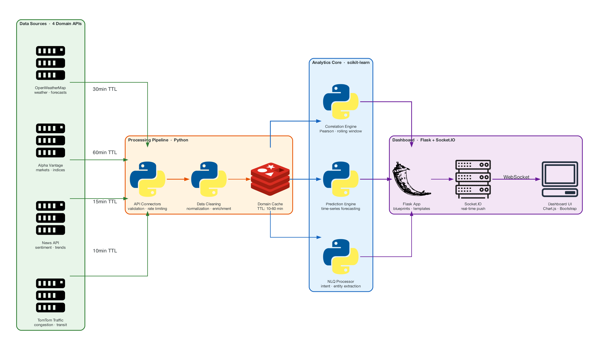
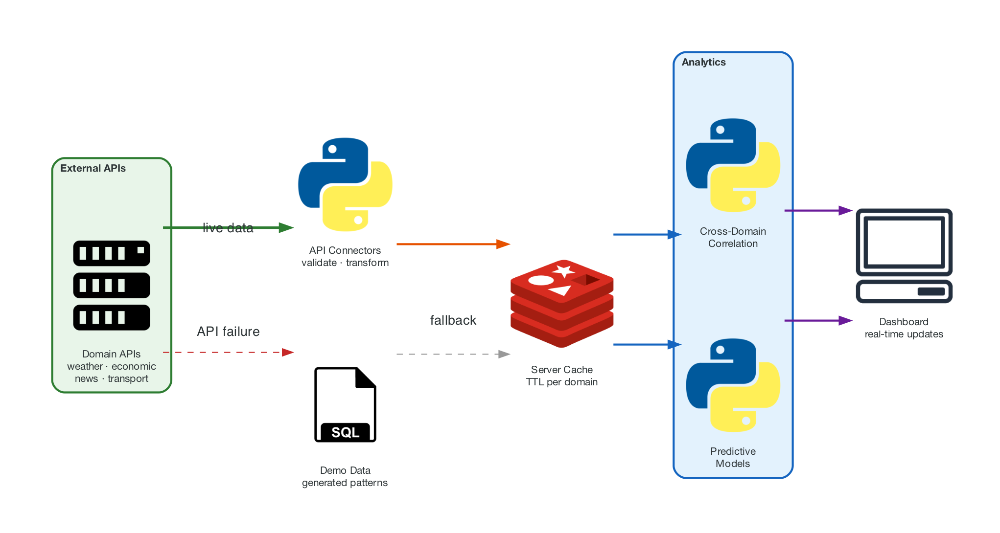

# Cross-Domain Predictive Analytics Dashboard

[](https://github.com/damsolanke/Cross_Domain_Predictive_Analytics_Dashboard/actions/workflows/ci.yml)

A Flask + Flask-SocketIO dashboard that pulls four public data domains: weather (OpenWeatherMap), economic indicators (Alpha Vantage), news headlines standing in for social media (News API) and road traffic (TomTom), and looks for correlations between them. Every connector has a simulated-data fallback, so the whole app runs on a laptop with no API keys.

## Status

**Archived.** This was a five-person university course project built in April to May 2025. Since then the owner has made only maintenance changes: fixing the test suite and a correlation-key bug (March 2026), dependency pins, removal of committed credentials and this README. No further development is planned. The app still starts and the CI test suite passes, but read [What the code actually does](#what-the-code-actually-does) and [Known limitations](#known-limitations) before taking any number on the dashboard seriously.

## Team

Names, roles and assigned areas are taken from [CONTRIBUTING.md](CONTRIBUTING.md) and [team_contributions.md](team_contributions.md), which agree on names and roles. The last column lists the assignment, limited to paths that exist in this tree (`team_contributions.md` also credits Emmanuel with `app/static/js/visualization.js`, which was never committed). It is not a record of commit authorship: the git history shows most of the code under `app/`, including `app/templates/`, `app/static/`, `app/nlq/` and `app/api/connectors/`, committed by Ade as integrator, and Julie's commit `2681511` adding `app/api_clients/`, `app/data_processing/` and `app/storage/`.

| Member | Role | Assigned area |
|---|---|---|
| **Ade (Ademola Solanke)**, repo owner | System Integration & Real-Time Analytics | `app/system_integration/`: `pipeline.py` (data pipeline), `alert_system.py` (threshold alerts), `integration.py` (component registry), `events.py` + `socket_events.py` (Socket.IO events), `routes.py` (system status and correlation endpoints), and its tests in [`tests/test_system_integration.py`](tests/test_system_integration.py). Design notes in [`docs/system_architecture.md`](docs/system_architecture.md) and [`docs/ade_system_integration_readme.md`](docs/ade_system_integration_readme.md). Two files in the same package, `cross_domain_correlation.py` and `cross_domain_prediction.py`, are Chao's (per `team_contributions.md`). |
| **Rujeko** | Frontend Development | `app/templates/`, `app/static/css/`, `app/static/js/`; the implementation plan and standalone prototypes are in `Rujeko_Files/` |
| **Emmanuel** | Data Visualization | `app/visualizations/` (formatter registry, base formatter, confidence scoring) and `app/templates/visualization.html` |
| **Julie** | API Integration & Data Processing | `app/api/connectors/` (base connector plus the weather, economic, social media and transportation connectors), `app/storage/`, `app/api/routes.py` |
| **Chao** | Machine Learning & Predictive Modeling | `lstm_model.py`, `app/models/`, `app/system_integration/cross_domain_correlation.py`, `app/system_integration/cross_domain_prediction.py` |

## Architecture

<p align="center">
  
</p>

| Domain | Live source (needs a key) | Cache TTL | Simulated fallback |
|---|---|---|---|
| Weather | OpenWeatherMap current weather + 5-day forecast | 30 min | hash-seeded values around 20 °C / 68 °F with a per-location condition |
| Economic | Alpha Vantage stock index (ETF proxies) and FX daily series | 60 min | series built from a country trend, a seasonal term and random changes |
| News / "social" | News API top headlines and `everything` search | 15 min | generated trending topics, keyword sentiment, engagement |
| Transportation | TomTom traffic flow segment (current vs free-flow speed) | 10 min | rush-hour congestion curve, incidents, hotspots |

Each connector goes **cache → live API (only if its key is set) → simulated data**. A missing key is logged once at startup and never contacted; see `app/config.py`.

<p align="center">
  
</p>

## What the code actually does

Earlier versions of this README described scikit-learn time-series models and NLP intent classification. The code is simpler than that; this table says what each feature really is and where to look.

| Feature | Implementation | Where |
|---|---|---|
| Cross-domain correlation | Pearson correlation via `numpy.corrcoef` between two domain fields, cached per pair. The offline helper in `app/data_processing/correlator.py` also computes Spearman with `scipy.stats`. | `app/system_integration/cross_domain_correlation.py` |
| "Predictions" | Simulated forecasts. The domain models in `app/models/` extend the current value with hand-written patterns (seasonal baseline and time-of-day offset for temperature, rush-hour curves for congestion, random walks for markets) plus noise that grows with the horizon. `CrossDomainPredictor` returns a weighted average of the correlated source fields' current values, weighted by |correlation|, with confidence = mean |correlation| capped at 0.95. Nothing is trained at runtime. | `app/models/`, `app/system_integration/cross_domain_prediction.py` |
| LSTM | `lstm_model.py` is a standalone Keras script (MinMaxScaler → LSTM → dense). It is not imported by the app. | `lstm_model.py` |
| Natural-language queries | Keyword matching. `app/nlq/processor.py` picks the intent whose example sentences share the most words with the query; `app/nlq/api.py` uses regex keyword lists instead. Domains come from keyword lists, time ranges from a fixed phrase table. There is no trained classifier or entity extractor. | `app/nlq/`, `app/system_integration/natural_language_processor.py` |
| Sentiment | Counts of positive/negative words in headline text. | `app/api/connectors/social_media_connector.py`, `app/system_integration/api_connectors.py` |
| Real-time updates | Flask-SocketIO namespace `/system-updates` with `subscribe_to_updates`, `get_correlation_data` and `get_correlation_insights` events; `events.py` emits `<domain>_update` and `alert`. | `app/system_integration/socket_events.py`, `app/system_integration/events.py` |
| Alerts | Threshold checks on incoming data points with info/warning/critical levels and a history. | `app/system_integration/alert_system.py` |
| Confidence charts | Plotly chart builders (radar, reliability heatmap, confidence trend) for confidence metrics passed in by the caller. No scoring logic, and nothing in the app calls them. | `app/visualizations/confidence_scoring.py` |

## Setup

Python 3.9 is what CI runs; 3.10 has also been verified with the same pins.

```bash
git clone https://github.com/damsolanke/Cross_Domain_Predictive_Analytics_Dashboard.git
cd Cross_Domain_Predictive_Analytics_Dashboard
python -m venv venv && source venv/bin/activate

# Same list CI installs (.github/workflows/ci.yml); enough to run the app and the tests
pip install Flask==2.2.3 Werkzeug==2.3.8 flask-socketio==5.5.1 pandas==1.5.3 numpy==1.24.3 \
  scikit-learn==1.3.0 scipy==1.11.1 requests==2.28.2 "urllib3<2" pytest==7.4.0 pytest-flask==1.2.0 \
  python-dotenv==1.0.0 plotly==5.14.1 matplotlib==3.7.1 seaborn==0.12.2 statsmodels==0.14.0

cp .env.example .env   # optional; blank keys mean simulated data
python run.py          # http://localhost:5000
```

`requirements.txt` additionally pins TensorFlow and Keras (only `lstm_model.py` uses them) and Selenium (only `app/tests/test_browser.py` uses it).

### Environment variables

All keys are read in one place, `app/config.py`. Each has a canonical name and a legacy alias; the canonical name wins when both are set, and a blank value counts as unset.

| Variable | Legacy alias (still honoured) | Used for | Without it |
|---|---|---|---|
| `OPENWEATHER_API_KEY` | `WEATHER_API_KEY` | OpenWeatherMap current weather and forecast | simulated weather |
| `ALPHAVANTAGE_API_KEY` | `ECONOMIC_API_KEY` | Alpha Vantage index and FX series | simulated markets |
| `NEWSAPI_KEY` | `SOCIAL_MEDIA_API_KEY` | News API headlines (the "social media" source) | simulated trends and sentiment |
| `TOMTOM_API_KEY` | `TRANSPORTATION_API_KEY` | TomTom traffic flow | simulated traffic |
| `SECRET_KEY` | none | Flask session secret | random value per start |
| `TESTING` | none | Flask testing mode (`True`/`False`) | off |

Free-tier limits and sign-up links are in [`docs/api_configuration_guide.md`](docs/api_configuration_guide.md). `.env` is git-ignored.

## Tests

```bash
TESTING=True python -m pytest tests/ app/tests/ -v --ignore=app/tests/test_browser.py
```

That is the CI command: 30 tests covering the system integration layer (pipeline, alerts, registry, HTTP endpoints, socket connection), cross-domain correlation, the NLQ processor and API, and API-key configuration with the no-key fallback. No test needs network access or an API key.

Not part of CI: `app/tests/test_browser.py` needs Selenium, a browser driver and a running server; `app/visualizations/tests/` is not included in the CI command.

## Project structure

```
app/
├── __init__.py               create_app() factory, blueprint registration
├── config.py                 API key resolution (canonical names + aliases)
├── api/                      /api routes and the four domain connectors (api/connectors/)
├── api_clients/              earlier REST client classes; not wired into the app
├── data_processing/          cleaner, correlator (Pearson/Spearman), transformer, validator
├── demo/                     data generators and the correlation demo blueprint
├── main/                     page routes, use-case pages, analytics controller
├── models/                   simulated per-domain forecast models
├── nlq/                      natural-language query processor, API and templates
├── storage/                  SQLAlchemy/sqlite manager, file cache, DataFrame storage; not imported by the app
├── system_integration/       pipeline, alerts, registry, socket events, correlation, prediction
├── visualizations/           Plotly formatters and confidence scoring
├── static/, templates/       Bootstrap UI, dashboard JS, Jinja templates
└── tests/                    unit tests (correlation, NLQ, config)
tests/                        system integration tests
docs/                         architecture notes, API configuration guide, diagrams
scripts/generate_diagrams.py  regenerates docs/images/*.png
lstm_model.py                 standalone Keras LSTM script
run.py                        starts the Socket.IO server on port 5000
```

## Known limitations

- Forecasts and confidence scores are simulated (see the table above). Nothing is trained at runtime and the LSTM script is not connected to the app.
- Correlations are computed over whatever is in process memory at the time. With simulated data they describe the generators, not the world; with live keys they need hours of collection before there are enough points.
- The "social media" domain is News API headlines with a word-list sentiment score. The Twitter client in `app/api_clients/social_client.py` is not used anywhere.
- There is no database. All data, alerts and correlation caches live in process memory and are lost on restart. `app/storage/database.py` exists but nothing imports it, and its psycopg2/SQLAlchemy dependencies are not pinned anywhere.
- No authentication, and Socket.IO is started with `cors_allowed_origins="*"`. Run it locally only.
- Only Python 3.9 and 3.10 have been verified; the pinned numpy 1.24.3 and pandas 1.5.3 predate 3.12.
- Housekeeping leftovers from the course: `Rujeko_Files/` (frontend prototypes), `tem-integration` (a stray pager dump), `run_app.sh` (a macOS-specific path), and mixed CRLF/LF line endings.

## License

MIT. See [LICENSE](LICENSE).
